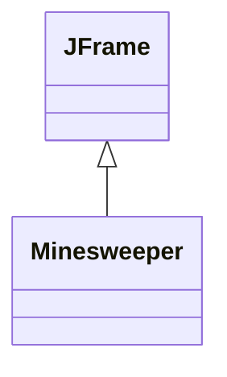
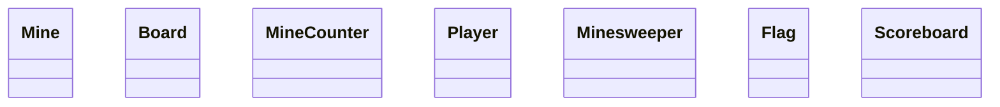
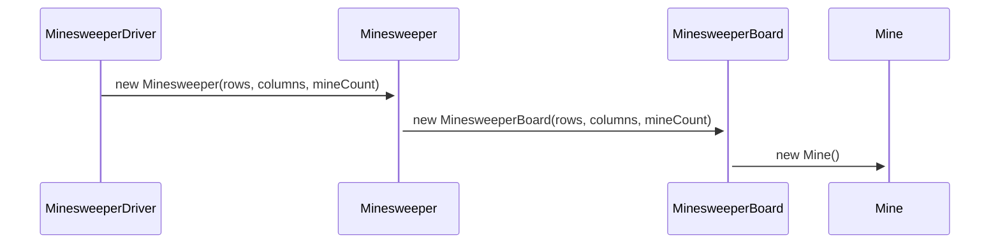

## Design Notes From The Class
* making a list of lists (or just a list) for storing the squares
  * if single list, make method to convert index to row,col (and vice-versa)
* it'd be nice if the dimensions and number of mines were parameters to a constructor
* will need a method to select a square and check if it has a mine
* will need a way to mark a square as having a mine with a flag
* have a way to show all bombs if a bomb was hit
* need a timer to time how long it takes to win
* click a square, show number around it - sum # of mines around it
* probably have a panel with a grid layout

## UML Options
#### First Attempt

* this has everything in one class, probably meaning there is low cohesion

#### Second Collective Attempt

We can make a sequence diagram to start to understand how the objects all work together.
